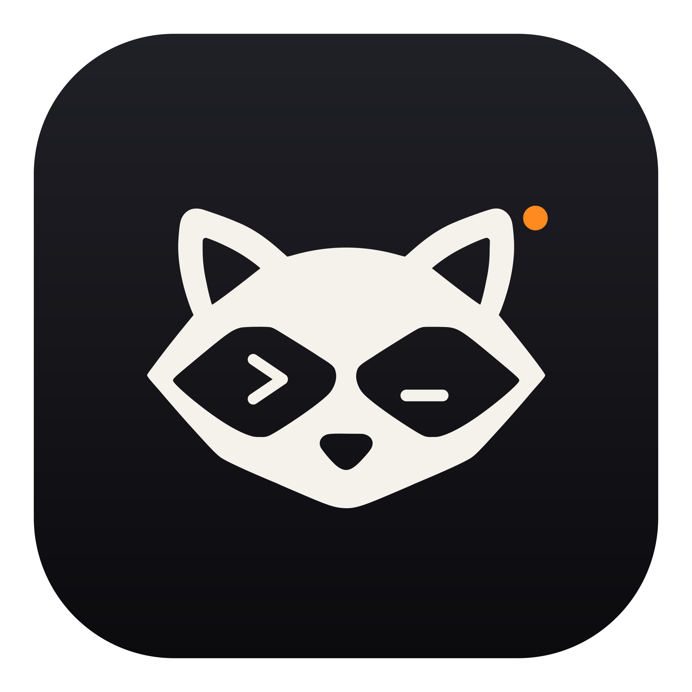

  

<h1 align="center">Bandito</h1>

<b>Your AI crew. On your own server.</b> 
Claude Code, Codex and Grok agents that keep working after you close the laptop.

  <a href="https://bandito.dev">bandito.dev</a> ·
  <a href="https://x.com/banditohq">@banditohq</a>

---

> **Status:** early development, building in public. Nothing to install yet. Star or watch the repo to follow along.

## What it is

- **A tiny daemon on your server.** Rust, one binary, runs as a service. No Electron, no headless browser.
- **Native apps.** SwiftUI for Mac and iPhone. Close the lid, your crew keeps working; approve risky steps from the lock screen.
- **The agents you already use.** Claude Code, Codex and Grok through their official CLIs, or straight API keys.
- **A crew, not a chat.** Agents with roles and schedules that message each other and report back to you.

## Repository layout

| Path | What |
|---|---|
| `daemon/` | The server daemon (Rust) |
| `apps/` | Mac and iPhone apps (SwiftUI) |
| `docs/` | Documentation |
| `brand/` | Logos and press kit |

## License

[Functional Source License 1.1, ALv2 Future License](LICENSE.md). Use it, read it, change it, self-host it. You can't sell a competing product built from it. Every release becomes Apache 2.0 two years after it ships.
